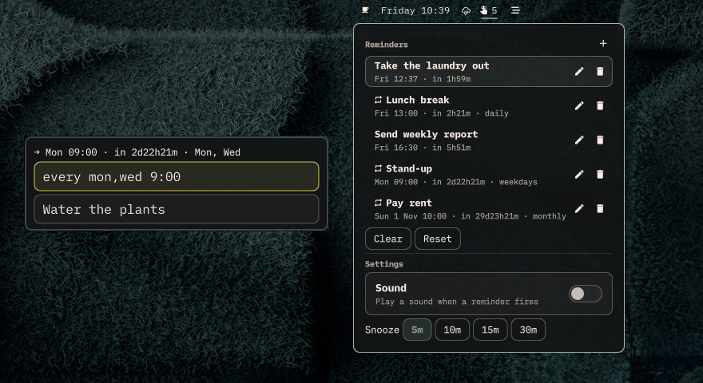

# Ominder

Reminders for [Omarchy](https://omarchy.org): flexible times, repeats, snooze, notification sound, and a panel to manage everything. Ominder replaces Omarchy's built-in reminder overlay and keeps its look, keybindings, and keyboard-first flow.

> **Status:** early development. The plugin currently ships simple functionality and UI. See [`docs/SPEC.md`](docs/SPEC.md) for the planned behaviour so far.



## Install

```bash
omarchy plugin add https://github.com/Excalimbito/ominder.git --enable
```

Enabling Ominder puts a bell with the number of upcoming reminders in the bar and takes over Omarchy's reminder overlay. Reminders created with `omarchy-reminder` are moved over to Ominder automatically.

### Dependencies

Ominder installs nothing. It uses tools that ship with Omarchy: a systemd user session, `jq`, `flock`, `qml6`, `pw-play`, `hyprctl`, and Omarchy's `omarchy-shell` and `omarchy-notification-send`.

### What it changes outside the plugin folder

- Creates `ominder-<id>.timer` / `.service` units in `~/.config/systemd/user` and starts or stops them with `systemctl --user`.
- Stores reminders in `~/.local/state/ominder/`.
- Writes `~/.local/state/omarchy/toggles/hypr/ominder.lua` to rebind `Super+Ctrl+Alt+R` and `Super+Shift+Ctrl+R`. The file has no effect once the plugin folder is gone.
- Stops active `omarchy-reminder` timers and recreates them as Ominder reminders.

`ominder uninstall` removes all of the above.

## Usage

| Keys | Action |
|---|---|
| `Super+Ctrl+R` | Create a reminder |
| `Super+Ctrl+Alt+R` | Open the reminder panel |
| `Super+Shift+Ctrl+R` | Clear one-time reminders |

The create overlay has two fields. Type a time in *when* and press Enter, type the message and press Enter again. The line above the fields previews when the reminder fires. Escape clears a field, then closes the overlay.

Clicking the bell opens the panel: upcoming reminders with edit and delete, **Clear** (one-time reminders), **Reset** (everything, after confirmation), and settings. In the panel, `j`/`k` move, Enter edits, `x` deletes, and `n` creates.

Left-clicking a reminder notification snoozes it. Right-clicking dismisses it.

### Time expressions

| Form | Example |
|---|---|
| Minutes | `30` |
| Duration | `90m`, `1h30m`, `2h` |
| Clock time (today, or tomorrow if passed) | `14:30` |
| Tomorrow | `tomorrow 9:00` |
| Weekday | `fri 14:00` |
| Date | `2026-10-05 9:00` |
| Every interval | `every 30m` |
| Every day | `every day 8:00` |
| Chosen days | `every mon,wed 9:00`, `every weekday 9:00` |
| Monthly | `every 1st 10:00` |

A reminder whose time passes while the computer is off does not fire.

## Command line

The plugin ships its CLI at `bin/ominder` inside the plugin folder. To put it on your `PATH`:

```bash
ln -s ~/.config/omarchy/plugins/io.github.excalimbito.ominder/bin/ominder ~/.local/bin/ominder
```

```
ominder <when> [message]             create a reminder
ominder list [--json]                list upcoming reminders
ominder rm <id>                      delete a reminder
ominder edit <id> <when> [message]   change a reminder's time and/or message
ominder snooze <id>                  remind again after the snooze length
ominder clear                        delete one-time reminders
ominder reset [--yes]                delete every reminder, including repeating ones
ominder panel                        open the reminder panel
ominder parse [--json] <when>        show when a time expression fires
ominder uninstall                    remove all reminders, timers, and the keybinding stub
```

`ominder 30 "message"` works like `omarchy-reminder 30 "message"`.

## Settings

Settings live on the Ominder entry in `~/.config/omarchy/shell.json` and can be changed from the panel or by hand:

| Key | Default | |
|---|---|---|
| `sound` | `true` | Play a sound when a reminder fires |
| `soundFile` | `/usr/share/sounds/freedesktop/stereo/complete.oga` | Played with `pw-play` |
| `snoozeMinutes` | `5` | Snooze length |

## How it works

Each reminder is a systemd user timer, `~/.config/systemd/user/ominder-<id>.timer`, with its data in `~/.local/state/ominder/reminders.json`. Keybindings are set by a stub in `~/.local/state/omarchy/toggles/hypr/ominder.lua`, which Omarchy loads on every Hyprland reload. While the plugin is disabled, the keys fall back to `omarchy-reminder`.

## Remove

Run `ominder uninstall` first, so no timers are left behind, then remove the plugin:

```bash
~/.config/omarchy/plugins/io.github.excalimbito.ominder/bin/ominder uninstall
omarchy plugin remove io.github.excalimbito.ominder
```

## Development

```bash
node test.js     # time parser
bash test.sh     # CLI, against temporary XDG directories
omarchy plugin validate .
qmllint -I "$OMARCHY_PATH/shell" BarWidget.qml Panel.qml ReminderFlow.qml
```

Changes to `ReminderFlow.qml` need `omarchy-restart-shell`, because the overlay stays loaded between summons.

## License

MIT. See [`LICENSE`](LICENSE).
